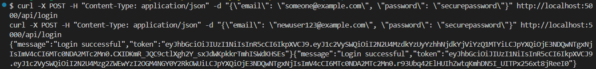

# API Tests

NOTE: You need two 2 Terminals Open.

- 1 For the Server

- 1 For the CURL Commands.

NB: You need to install CURL for Windows and add it to path OR be using a Linux Machine.

### Auth API Test Setup

For index.js, startup the node server in the same directory as index.js using the console command: 

```npm run dev```


To terminate the server, do Ctrl+C in the terminal.


### Campaign API Test Setup:

For server.py, startup the flask server in the *backend* directory, hence using the console command: 

```python -m src.server```


To terminate the server, do Ctrl+C in the terminal.

## Auth Tests:

#### 1. Login (JavaScript -> index.js)


```sh
curl -X POST -H "Content-Type: application/json" -d "{\"email\": \"someone@example.com\", \"password\": \"securepassword\"}" http://localhost:5000/api/login
curl -X POST -H "Content-Type: application/json" -d "{\"email\": \"newuser123@example.com\", \"password\": \"securepassword\"}" http://localhost:5000/api/login
```



#### 2. Register (JavaScript -> index.js)


```sh
curl -X POST -H "Content-Type: application/json" -d "{\"email\": \"someone@example.com\", \"password\": \"securepassword\"}" http://localhost:5000/api/register
curl -X POST -H "Content-Type: application/json" -d "{\"email\": \"newuser123@example.com\", \"password\": \"securepassword\"}" http://localhost:5000/api/register
```


### 3. Forgot Password (JavaScript -> index.js) (Mail Service -> SendGrid) (GitHub Pages Required for Testing)

NB: MAIL SERVER NOT YET SETUP

```sh
curl -X POST -H "Content-Type: application/json" -d "{\"email\": \"someone@example.com\"}" http://localhost:5000/api/auth/forgot-password
curl -X POST -H "Content-Type: application/json" -d "{\"email\": \"newuser123@example.com\"}" http://localhost:5000/api/auth/forgot-password
```


### 4. Reset Password (JavaScript -> index.js) (Mail Service -> SendGrid) (GitHub Pages Required for Testing)

NB: MAIL SERVER NOT YET SETUP

```sh
curl -X POST -H "Content-Type: application/json" -d "{\"token\": \"<token-from-email>\", \"newPassword\": \"NewSecurePass123\"}" http://localhost:5000/api/auth/reset-password

```


## Campaign Tests:


### 5. Campaign Creation (Python -> server.py) 

```sh
curl -X POST http://localhost:5000/api/campaigns -H "Content-Type: application/json" -d "{ \"name\": \"Summer Sale\", \"description\": \"Discounts on all items\", \"budget\": 5000, \"startDate\": \"2024-07-01\", \"endDate\": \"2024-07-31\", \"createdBy\": \"user123\" }"
```


### 6. Get All Campaigns (Python -> server.py) (NOTE: When testing in console, "campaigns/" sends a 404 while "campaigns" do not.)

```sh
curl -X GET http://localhost:5000/api/campaigns
```


### 7. Get Campaign by ID (Python -> server.py)

```sh
curl -X GET http://localhost:5000/api/campaigns/1
```


### 8. Update Campaign (Python -> server.py)
```sh
curl -X PUT http://localhost:5000/api/campaigns/1 -H "Content-Type: application/json" -d "{\"name\": \"Updated Spring Campaign\", \"created_by\": 1, \"status\": \"completed\", \"start_date\": \"2025-04-01\", \"end_date\": \"2025-04-30\"}"
```


### 9. Delete Campaign (Python -> server.py)

```sh
curl -X DELETE http://localhost:5000/api/campaigns/1
```


## Misc (Bulk Test Cases + TODO)

curl -X POST -H "Content-Type: application/json" -d "{\"email\": \"someone@example.com\", \"password\": \"securepassword\"}" http://localhost:5000/api/register
curl -X POST -H "Content-Type: application/json" -d "{\"email\": \"someone@example.com\", \"password\": \"securepassword\"}" http://localhost:5000/api/login
curl -X POST -H "Content-Type: application/json" -d "{\"email\": \"someone@example.com\"}" http://localhost:5000/api/auth/forgot-password
curl -X POST -H "Content-Type: application/json" -d "{\"token\": \"<token-from-email>\", \"newPassword\": \"NewSecurePass123\"}" http://localhost:5000/api/auth/reset-password

Create Campaign, Get Analytics, Create Segment & Create Email Template.


